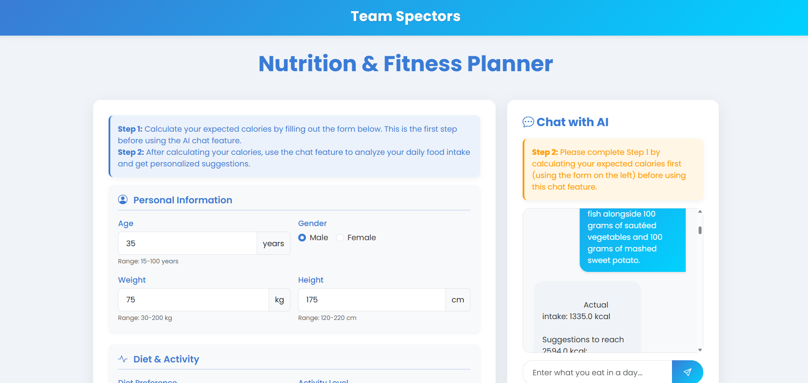
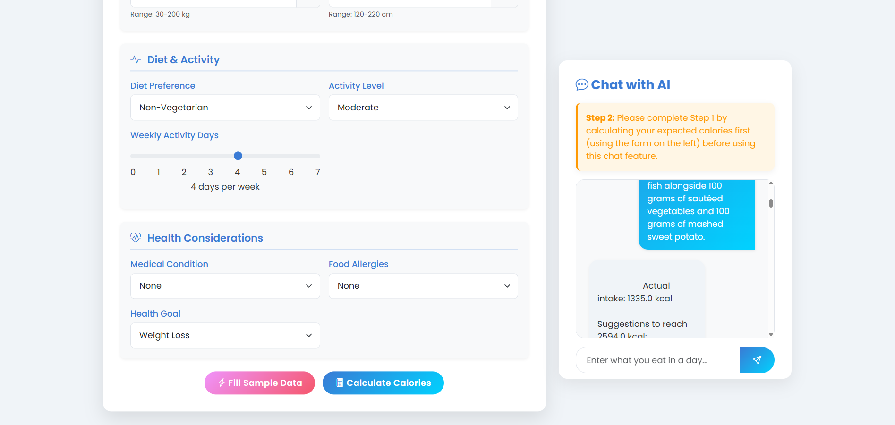
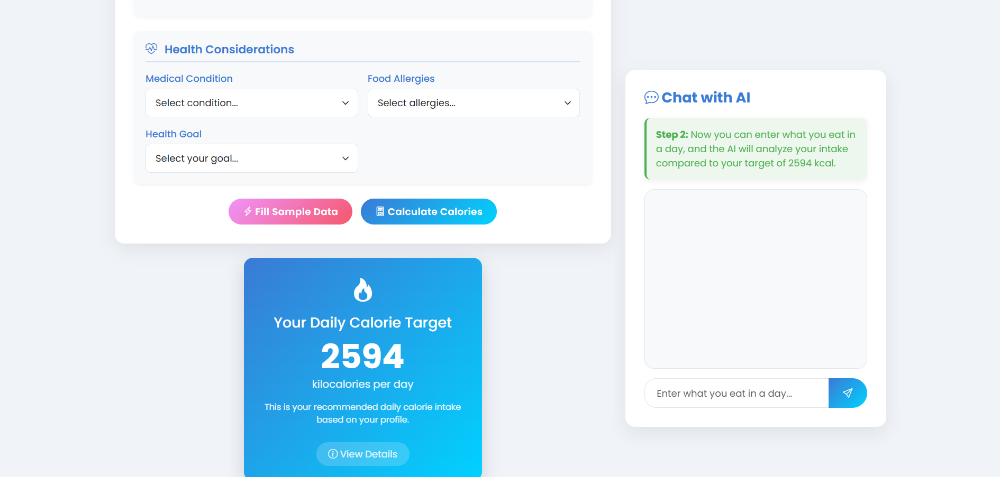
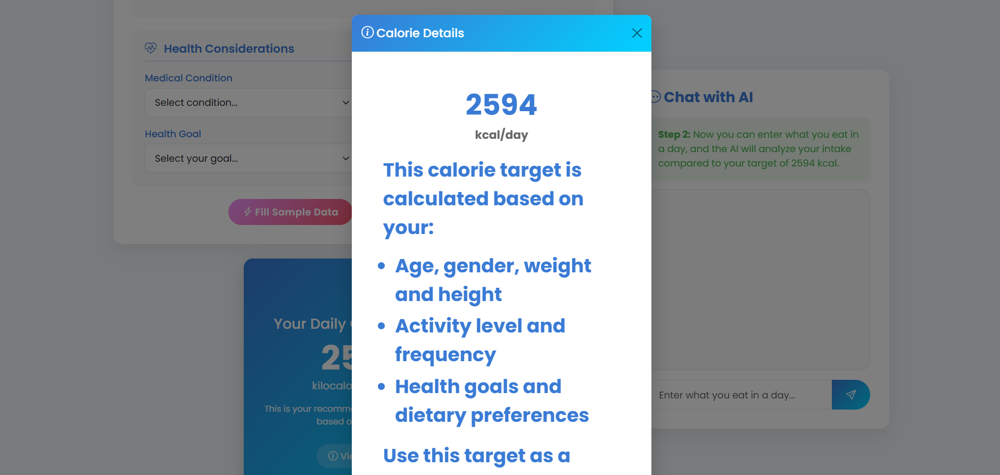

---

# 🥗 AI-Powered Personalized Dietary Recommendation System

## 📘 Overview

This project is an innovative dietary platform that leverages artificial intelligence to provide dynamic, personalized meal and habit suggestions. Unlike traditional systems that offer static, predefined meal plans, our solution adapts to each user's unique health profile, preferences, and goals, ensuring more effective and sustainable healthy living.

## ❗ Problem Statement

Many existing dietary and nutrition platforms provide users with generic, predefined meal plans that fail to account for individual preferences, health conditions, and lifestyle changes. This one-size-fits-all approach often leads to poor adherence, limited personalization, and suboptimal health outcomes.

## 💡 Our Solution

We present an AI-powered dietary recommendation system that dynamically generates personalized meal and habit suggestions based on each user's unique health profile, goals, and feedback. By integrating machine learning for calorie prediction and generative AI for adaptive meal planning, our platform offers real-time, interactive guidance that evolves with the user's needs, making healthy eating more accessible and sustainable.

## 🎯 Features

* 🤖 **AI-Powered Chat:**
  Get real-time, intelligent meal suggestions through an interactive AI assistant powered by Google Gemini.
* 🔥 **Calorie Prediction:**
  Predict daily calorie needs using a trained RandomForest model based on health and lifestyle inputs.
* 📅 **Dynamic Meal Planning:**
  Adaptive suggestions that evolve with user feedback, goals, and progress over time.
* 🧠 **ML-Driven Insights:**
  Personalized health tips derived from custom-trained models and datasets.
* 💻 **Modern UI:**
  Clean, responsive web interface with an intuitive, step-by-step workflow.

## 🌍 Potential Real-World Impact

* 🧬 Personalized health improvement
* 🙋‍♀️ Higher user engagement
* 🌐 Scalable for diverse populations
* 🏥 Preventive healthcare support

## 🛠️ Tech Stack

**🔧 Backend:**

* 🐍 Flask
* 📘 scikit-learn
* 🧮 pandas
* 💾 joblib
* 🌟 Google Generative AI (Gemini Flash 2.0)
* 🔐 python-dotenv

**🎨 Frontend:**

* 🌐 HTML/CSS
* 🎀 Bootstrap
* ✍️ Google Fonts (Poppins)
* 💻 JavaScript

## 📊 Data & Model

* 🌲 RandomForest model for calorie prediction
* 🗃️ Custom datasets for user profiling and meal suggestions

## 📁 Directory Structure

```
├── 📂 Data Sets/
│   ├── 📄 Final Data set.csv
│   ├── 📄 Meal suggestions.csv
│   └── 📄 Micro and macro nutrients.csv
├── 📂 Static/
│   └── 🎨 styles.css
├── ⚙️ config.py
├── 🚀 main.py
├── 📂 model/
│   └── 🤖 RandomForest1.pkl
├── 📦 requirements.txt
├── 📂 templates/
│   └── 🧾 index.html
└── 📂 user_data/
    └── ...
```

## 🖼️ Screenshots

### 🏠 Home Page



### 📝 Calorie Calculation Form



### 🔢 Calorie Result



### 📊 Calorie Details



## ⚙️ Setup Instructions

1. **📥 Clone the repository:**

   ```bash
   git clone <your-repo-url>
   cd <project-directory>
   ```

2. **📦 Install dependencies**

   ```bash
   pip install -r requirements.txt
   ```

3. **🚀 Run the Flask application**

   ```bash
   python main.py
   ```

4. **🌐 Access the application**

   * Open your browser and go to `http://localhost:5000`

## 🔄 How It Works

1. **Step 1:** 🧍‍♂️ User enters health and lifestyle details; the system predicts daily calorie needs.
2. **Step 2:** 💬 User chats with the AI assistant for personalized meal and habit suggestions.
3. **AI Feedback Loop:** 🔁 The AI refines its recommendations based on ongoing user interaction.

## 📜 License

This project is for educational and demonstration purposes.

---
